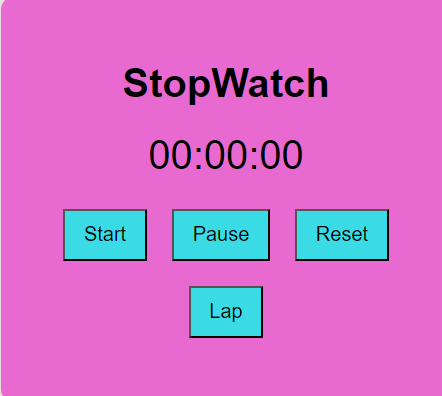

⏱️ Stopwatch Web Application

This is a simple and interactive Stopwatch Web App built with HTML, CSS, and JavaScript.  
Created as part of my internship at Prodigy InfoTech.

🚀 Features
- Start, Pause, and Reset functionality
- Lap time tracking
- Responsive and intuitive design

 🛠️ Technologies Used
- HTML5
- CSS3
- JavaScript (Vanilla)

📸 Screenshots

